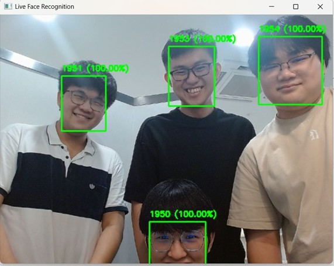

# Real-Time Enhanced AI Based Facial Recognition System for Smart Classrooms

## 📖 Overview

This project is a robust, automated attendance system designed for smart classroom environments. It replaces traditional manual roll calls with a high-accuracy, real-time facial recognition engine integrated into a responsive web application.

Unlike standard recognition systems that fail in poor lighting, this system utilizes advanced image preprocessing (**CLAHE** and **Gamma Correction**) to ensure reliability in dark environments, variable lighting, and long-distance scenarios. The system achieves a **99.45% accuracy rate** using a KNN classifier on ArcFace embeddings.

## 🚀 Key Features

### 🧠 AI & Computer Vision Engine
*   **Robust Face Detection:** Utilizes **RetinaFace** for single-shot, multi-level face localization (capable of detecting small faces in large lecture halls).
*   **Discriminative Feature Extraction:** Implements **ArcFace** (Additive Angular Margin Loss) to map faces into 512-dimensional embeddings.
*   **Low-Light Immunity:** A distinct preprocessing pipeline using **CLAHE** (Contrast-Limited Adaptive Histogram Equalization) and **Gamma Correction** to normalize lighting conditions before recognition.
*   **High-Performance Classification:** Uses **K-Nearest Neighbors (KNN)**, selected over SVM and Random Forest for its superior accuracy (99.45%) and efficient lazy-learning architecture.
*   **Multi-Face & Motion Handling:** Capable of recognizing multiple students simultaneously and handling motion blur using Gaussian Blur augmentation during training.

### 💻 Full-Stack Web Application
*   **Student Registration Portal:** A React-based interface allowing administrators to register new students via webcam. The system captures images, generates embeddings, and updates the database in **<1 minute**.
*   **Live Attendance Dashboard:** Real-time visualization of students entering the classroom, displaying names and recognition confidence.
*   **Attendance Management:** Admin panel to view historical logs, modify records, and analyze attendance trends.
*   **Automated Alerts:** Automatically flags students falling below specific attendance thresholds (e.g., <40%).
*   **Security:** Password hashing using **bcrypt** and secure RESTful API communication.

## 🛠️ Tech Stack

### Artificial Intelligence
*   **Language:** Python 3.x
*   **Libraries:** OpenCV, Scikit-Learn, NumPy, Pandas
*   **Models:** RetinaFace (Detection), ArcFace (Embeddings), KNN (Classification)
*   **Augmentation:** Albumentations (Horizontal Flip, Shift/Scale/Rotate, Brightness)

### Web Application (MERN)
*   **Frontend:** React.js, Tailwind CSS
*   **Backend:** Node.js, Express.js
*   **Database:** MongoDB (NoSQL) - Stores student profiles, face embeddings, and attendance logs.

## 📊 System Workflow

1.  **Image Input:** Live feed from classroom cameras (e.g., Logitech C920).
2.  **Preprocessing:** Frame conversion (BGR to RGB) -> CLAHE -> Gamma Correction.
3.  **Detection:** RetinaFace locates faces in the enhanced frame.
4.  **Feature Extraction:** ArcFace generates a 512-D embedding vector.
5.  **Classification:** KNN calculates Euclidean distance against the MongoDB dataset.
6.  **Attendance Logging:** If the similarity threshold (>0.8) is met, attendance is marked in the database.

## 📷 Screenshots

### 1. Live Recognition in Low Light (Robustness Test)
*Demonstrating the system's ability to detect faces in dark environments using CLAHE.*

### 2. Student Registration Interface
*The React-based portal for enrolling new students.*

### 3. Multi-Face Detection
*Simultaneous recognition of multiple students.*

## 📈 Performance Results

The system was evaluated using 5-fold cross-validation on the **Labeled Faces in the Wild (LFW)** dataset (Deep-funneled).

| Classifier | Accuracy | Precision | Recall | F1-Score | Training Time |
| :--- | :--- | :--- | :--- | :--- | :--- |
| **KNN (Selected)** | **99.45%** | **0.99** | **0.99** | **0.99** | **0.0356s** |
| SVM | 99.25% | 0.99 | 0.99 | 0.99 | 8.8717s |
| Random Forest | 95.41% | 0.96 | 0.95 | 0.95 | 160.85s |

*   **Macro AUC Score:** 0.9941
*   **Average FPS:** ~2.74 (On NVIDIA GTX 1650 Ti)

